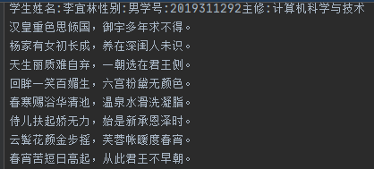

# EXperience-5
## 实验目的
* 掌握字符串String及其方法的使用
* 掌握文件的读取/写入方法
* 掌握异常处理结构

## 实验要求
* 设计学生类；
* 采用交互式方式实例化某学生；
* 设计程序完成上述的业务逻辑处理，并且把“古诗处理后的输出”结果存储到学生基本信息所在的文本文件A中。
对于下列文本
* 每7个汉字加入一个标点符号，奇数时加“，”，偶数时加“。”
* 允许提供输入参数，统计古诗中某个字或词出现的次数
* 输入的文本来源于文本文件B读取，把处理好的结果写入到文本文件A
* 考虑操作中可能出现的异常，在程序中设计异常处理程序
<b>
汉皇重色思倾国御宇多年求不得杨家有女初长成养在深闺人未识天生丽质难自弃一朝选在君王侧回眸一笑百媚生六宫粉黛无颜色春寒赐浴华清池
温泉水滑洗凝脂侍儿扶起娇无力始是新承恩泽时云鬓花颜金步摇芙蓉帐暖度春宵春宵苦短日高起从此君王不早朝承欢侍宴无闲暇春从春游夜专夜
后宫佳丽三千人三千宠爱在一身金屋妆成娇侍夜玉楼宴罢醉和春姊妹弟兄皆列士可怜光采生门户遂令天下父母心不重生男重生女骊宫高处入青云
仙乐风飘处处闻缓歌慢舞凝丝竹尽日君王看不足渔阳鼙鼓动地来惊破霓裳羽衣曲九重城阙烟尘生千乘万骑西南行
<b>
## 代码设计
#### 设计思路
   断句功能：通过read类读取文本内容，对字符计数，7奇偶倍数分别加逗号句号然后写入文本。
   查字功能：逐个读取字符与要查询字符比对计数。
   查词功能：逐行读取文本，在每行总搜索是否出现某词语，出现则进行计数。
   运用多线程：本程序不太需要多线程，但为了运用多线程，强行添加一个多线程实现查词功能。
#### 核心代码
实现断句功能
```
  int n = -1;
            int i = 0;
            byte [] a = new byte[100];
            File f = new File("src\\Experience1\\changhenge.txt");
            FileInputStream in = new FileInputStream(f);
            File targetFile = new File("src\\Experience1\\B.txt");
            Writer out = new FileWriter(targetFile,true);
            out.append(li.toString());
            System.out.println(li.toString());
            out.flush();
            while((n = in.read(a,0,2)) != -1){
                String s = new String (a,0,n);
                i++;
                out.write(s);
                out.flush();
                if(i%7 == 0 && i%14 != 0){
                    //out.write(s);
                    out.append("，");
                    out.flush();
                }

                else if(i%14 == 0){
                    out.append("。\n");
                    //out.write(s);
                    out.flush();
                }
                else{
                    //out.write(s);
                    out.flush();
                }
            }

            in.close();
```
实现创建多线程，实现查词功能。
```
//创建多线程的类
public class MultiThread extends Thread {
    //定义此线程查词功能的方法
    public static boolean Containstr(String s1, String s2) {
        if (s1.indexOf(s2) >= 0) {
            return true;

        } else {
            return false;
        }
    }
    //实现查找字词的主要方法
    public static void strfind(String file){
        File f = new File(file);
        int m = 0;
        try
        {
            FileReader fr = new FileReader(f);
            BufferedReader br = new BufferedReader(fr);
            List<String> list = new ArrayList<String>();
            String str = null;
            //int num = 1;
            while ((str = br.readLine()) != null)
            {
                list.add(str);
            }
            System.out.println("请输入查找的字词");
            Scanner sc = new Scanner(System.in);
            String strword = sc.nextLine();
            for (String s : list)
            {
                boolean b = Containstr(s, strword);
                if (b)
                {
                    //System.out.println(num + ":" + s);
                    m++;
                }
                //num++;
            }
            System.out.println("出现\""+strword+"\" 的次数是："+m);

        } catch (FileNotFoundException e)
        {
            e.printStackTrace();
        } catch (IOException e)
        {
            e.printStackTrace();
        }

    }


    //重写的是父类Thread的run()
    public void run(String file) {
        strfind(file);
    }
}
```
```
//学生管理的接口，定义学生必须要有的方法
interface StudentManage {
    void setfee(int fee);
    int getfee();
}
```

## 实验过程问题
   查词有别于查字功能，没法用read(array,off,len)，查阅资料找到了按行进行比对的方法。阅读同学代码，了解到Pattern.compile(String);Matcher matcher = pattern.matcher(String);方法进行查词。
## 实验结果

---

---
## 实验感想
   随着学习的深入，接触了越来越多的类与方法，这些东西难度不大，但是如果想要掌握，需要有一定量的练习。遇到问题时可以去查阅资料，参考别人的代码，学习一些新的知识，总结他人代码的长处（怎么去设计类，怎么增强代码的复写性，检查代码的逻辑完整性，代码的排版。）
   本学期的java实验到此告一段落。可以看出，java的学习仅限于此是远远不够的，个人对编程的理解，构架是骨，数据是肉，算法是魂。我们还没有接触数据与算法，还没有真正的编写出一个具有实用意义的程序。
学校的java课程应该是引领我们对java这门语言进行入门，接下来对java的学习就依赖个人了。在学习编程的过程中，要勤交流，多练习，多实践，才能有所进步。
   
